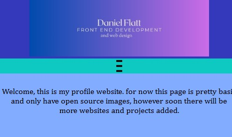

# Project Overview

The Idea behind this project is to be seen as a portfolio page for the progression of my career, this also means that as my confidence and skill grows, the page will evolve to reflect that.

The initial Intent is for the user to access the page, find out about me, be able to see some of my work and ultimately be able to contact me in various ways. 

# Functionalities 

Responsive navigation bar popup gallery compatability with mobile devices.

The responisive navigation bar was designed with mobile devices in mind, allowing for navigation at a click while providing a betteer user experience. this is compatible with android, iOS and PC.

The pop up gallery is designed with an onclick method that allows the user to expand the images and close  them via the 'X' on the top right corner. this works on both mobile and desktop.

# Technologies 
HTML - the base of the website.
CSS - adding layout and styles to the site.
CSS Flexbox including nested Flexboxes - added the structure to the website.
JavaScript - added functionality to the responsive navbar and popup gallery.
VSCode - the IDE.
GitHub - the host for the version control.
Git - the version control method.

# Accessibility 

This webite was designed with mobile devices in mind.

I used Lighthouse to test accessibility. See the below screenshot for the full report.

# Notes

The HTML validator(https://validator.w3.org/) found the errors with three placeholder links on the about me page. It also did not like the blanck src=" " on my modal on the gallery page.
the CSS Validator(https://jigsaw.w3.org/) found no issues.
# Sources/Resources 

Code Academy, Stack Overflow, W3Schools and my Mentor Nathan.
The Images used were sourced from https://unsplash.com/
The logo was made using https://www.design.com/
JShint for javascript testing, 
html formatted with https://www.freeformatter.com/